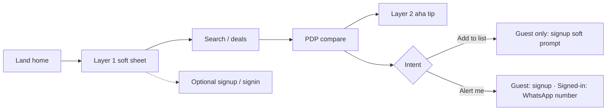

# Onboarding — conversion-first

**Status:** Implemented in UI (demo / localStorage)  
**Goal:** Maximise conversion without gating the aha moment (search → compare).

Related: [`user_flows.md`](./user_flows.md), [`HANDOVER.md`](./HANDOVER.md), [`ux-auth-forms.md`](./ux-auth-forms.md), `context.md` (“onboarding geared towards conversions”).

---

## Is it wise to put Sign up / Sign in in onboarding?

**Not as a welcome gate.** Forcing account creation before search kills conversion.

**Yes at moments of intent** — and as optional links from welcome:

| Approach | Verdict |
|----------|---------|
| Welcome wall: must Sign up before browsing | **Unwise** — blocks aha |
| Welcome: Search / Deals primary; Create account · Sign in as text links | **Wise** |
| After add-to-list / price alert: soft auth prompt | **Wise** (matches production: lists need accounts) |
| Hard-block lists for guests in the demo | Optional later; soft prompt first |

Auth here is **local preview only** (`signedIn` on `DemoUser`) — no real passwords or backend session.

---

## What “conversion” means here

1. **Aha** — first search / multi-price product compare  
2. **Habit** — first list save  
3. **Account** — sign up / sign in when they care (list / alert)  
4. **Lead** — WhatsApp number for price alerts (country code required)  
5. **Return** — come back (`easishop.demo.visited`)

Do **not** force signup, location, retailer picks, or loyalty before search.

---

## Architecture

| Layer | When | UI | Persistence |
|-------|------|-----|-------------|
| **1 — Welcome** | First open: `!onboardingSeen` and not returning visitor | Search · Deals · Skip + Create account · Sign in | `user.onboardingSeen` |
| **2 — Aha tip** | PDP with ≥2 available prices, once | Dismissible tip under Compare | `easishop.demo.onboard.aha` |
| **3a — List** | After first add-to-list, **guests only** | Soft signup / sign-in (“Keep this list”) | `easishop.demo.onboard.listPrompt` (signed-in users skip; flag marked seen) |
| **3b — Alert** | PDP “Alert me on WhatsApp” | Guest → `/signup?intent=alert`; signed-in → WhatsApp number | `priceAlerts` + profile phone |
| **Auth pages** | `/signup`, `/signin` | Minimal chrome; Google first; short form; WhatsApp if `intent=alert`; bottom-left orb; neutral inputs — see `ux-auth-forms.md` | `user.signedIn` |

Footer **Onboarding** (desktop) and Profile **Onboarding** (mobile) call `replayOnboarding()` — resets flags and sets `signedIn: false` so you can walk auth again.

---

## Anti-patterns (explicitly out)

- Multi-slide feature carousels before search  
- Favourite-store picker in onboarding  
- Location / suburb before value  
- Deep subcategory trees  
- Forced marketing opt-in  
- Password walls before the first compare  

---

## Analytics

| Event | Notes |
|-------|------|
| `onboard_shown` / `onboard_skipped` / `onboard_cta_search` / `onboard_cta_deals` | Layer 1 |
| `onboard_cta_signup` / `onboard_cta_signin` | Welcome, list, alert, profile |
| `onboard_aha_compare` | Layer 2 |
| `onboard_list_prompt_*` | Layer 3a |
| `onboard_alert_prompt_*` | Layer 3b |
| `sign_up` / `sign_in` / `sign_out` | Auth helpers |

---

## Key files

| File | Role |
|------|------|
| `src/lib/onboarding.ts` | Flags + replay |
| `src/lib/auth.ts` | Demo sign up / in / out |
| `src/components/auth/auth-form.tsx` | Shared form |
| `src/app/signup/page.tsx` / `signin/page.tsx` | Routes |
| `src/components/onboarding/*` | Layers 1–3 |
| `src/lib/analytics.ts` | Event names |

---

## How to re-test

1. Footer **Onboarding** (desktop) or Profile → **Onboarding** (mobile).  
2. Welcome → optional Create account / Sign in, or Search / Deals.  
3. As guest: add to list → auth soft prompt; Alert me → signup.  
4. After signup, return via `?next=` to lists or product.
